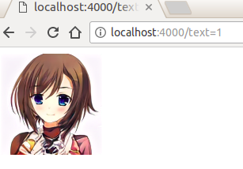
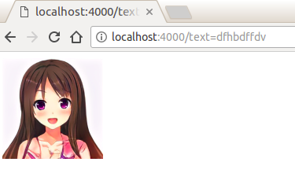

# hash2face
[](https://app.fossa.io/projects/git%2Bgithub.com%2FLinXueyuanStdio%2Fhash2face?ref=badge_shield)

map Hash to Face using GAN.





# usage

```
npm install
npm start
```


## License
[](https://app.fossa.io/projects/git%2Bgithub.com%2FLinXueyuanStdio%2Fhash2face?ref=badge_large)