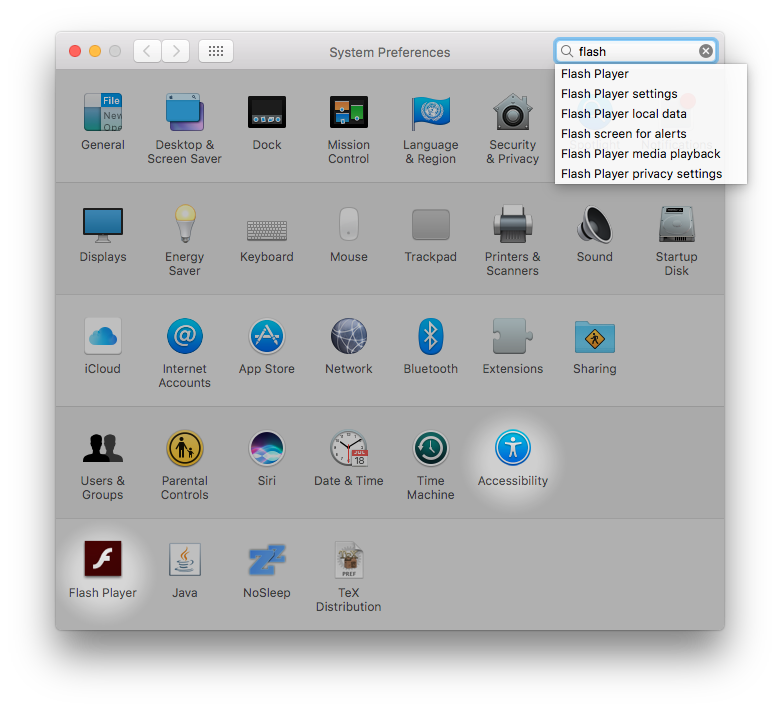
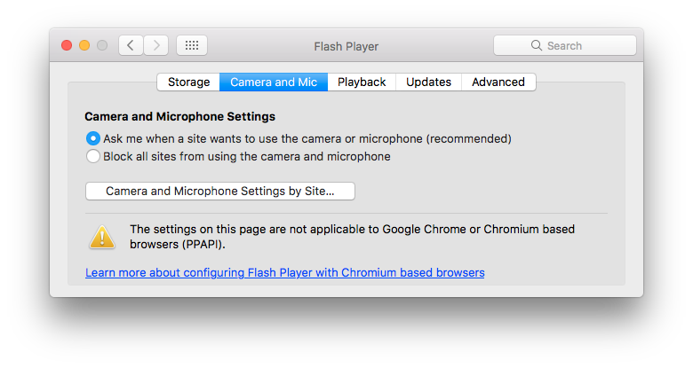
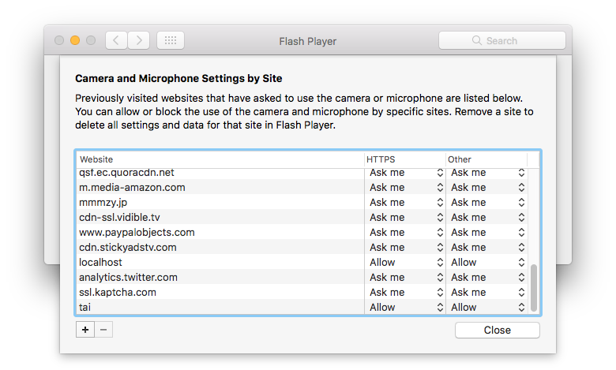

# Using web camera in Safari

## Background
Most modern web browsers support WebRTC, which supports easy access to camera from web page scripts.
However, Safari (on Mac) does not support WebRTC, so the workaround is to use Flash.

There is a good library "[webcamjs](https://github.com/jhuckaby/webcamjs)" to wrap the browser difference. To make this library to work, security setting is needed. This document describes how to change the setting.

## Flash player
You need to install and enable Flash player *on the target website* first.

Visit official instruction: 
[https://helpx.adobe.com/flash-player/kb/enabling-flash-player-safari.html](https://helpx.adobe.com/flash-player/kb/enabling-flash-player-safari.html)

## Security setting for camera
When you visit a website that want to access your camera, special permission is needed.

If you are lucky, you have only to click "Allow" button.

Sometimes, the button does not work. In this case, you need to change the setting from "System Preferences".

1. Open Flash Player

2. Click "Camera and Mic" tab and open "Camera and Microphone Settings by Site..." dialog

3. Change configuration to "Allow" for target website

